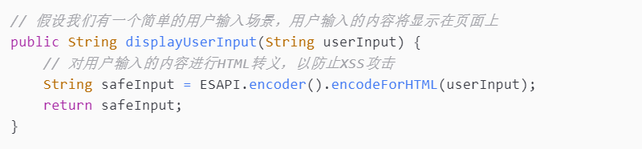
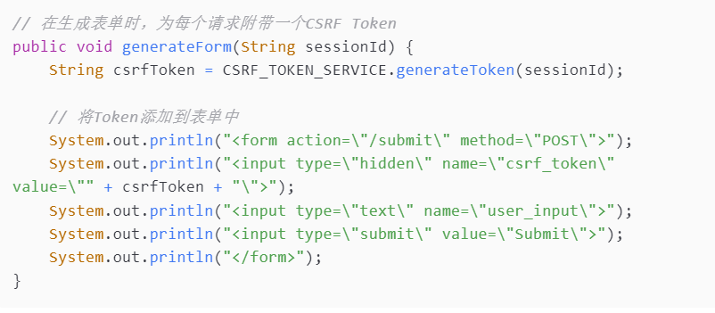
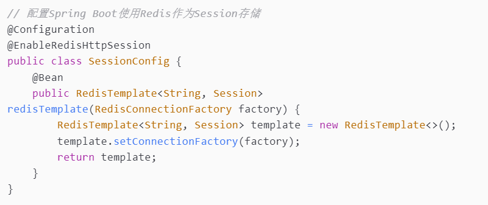
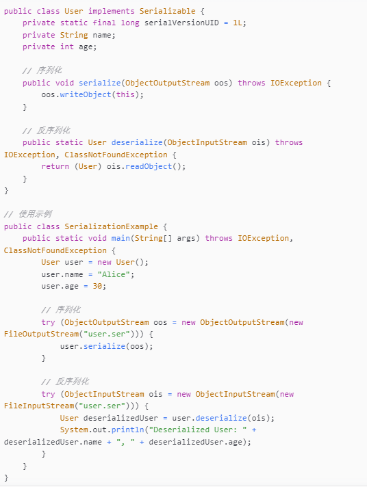
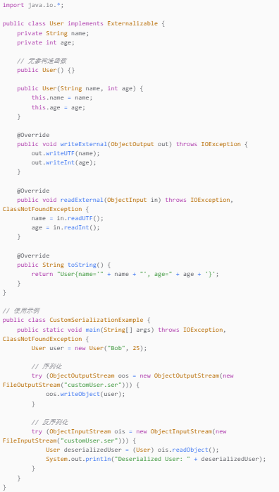

# 《会话技术》

**学院：省级示范性软件学院**

**题目：《会话技术》**

**姓名：焦雨飞**

**学号：2100950007**

**班级：软工2201**

**日期：2024-09-27**

**实验环境：IntelliJ IDEA 2024.2.1**

# 一、实验目的

- 理解和掌握会话技术的原理和实现方法。
- 学习如何在Web应用程序中管理和维护用户会话。
- 掌握会话安全性的防御措施，包括会话劫持、XSS和CSRF攻击的防御。
- 探索分布式系统中的会话管理问题和解决方案。
- 学习会话状态的序列化和反序列化技术，以及它们的应用场景。

# 二、实验内容

### 一、会话安全性

#### 1.会话劫持和防御
会话劫持是指攻击者通过某种手段获取用户的会话标识（如Cookie中的Session ID），进而冒充用户身份进行操作的行为。防御会话劫持的常见措施包括：

- **使用HTTPS**：确保会话Cookie在传输过程中不被监听和篡改 。
- **设置Cookie属性**：为Cookie设置`HttpOnly`和`Secure`属性，防止Cookie被客户端脚本访问和在非加密通信中传输。
- **定期轮换会话ID**：在用户登录后和在特定时间间隔后，服务器端重新生成会话ID，减少会话ID被劫持的风险。

#### 2.跨站脚本攻击（XSS）和防御
XSS攻击是指攻击者在网页中注入恶意脚本，当其他用户浏览该页面时，恶意脚本在用户浏览器上执行，从而窃取用户信息或控制用户浏览器行为。防御XSS攻击的措施包括：

- **输入验证**：对所有用户输入进行验证，不允许非法的HTML标签或JavaScript代码通过。
- **输出编码**：在将用户输入输出到页面时，进行HTML编码，确保特殊字符被正确转义。
- **使用内容安全策略（CSP）**：通过设置HTTP头部的Content-Security-Policy，限制网页可以加载的资源类型和来源。
- **代码示例**：

#### 3.跨站请求伪造（CSRF）和防御
CSRF攻击是攻击者利用用户已认证的会话，强制用户浏览器向服务器发起非用户意愿的请求。防御CSRF攻击的措施包括：

- **使用CSRF Token**：为每个请求绑定一个随机生成的Token，并在服务器端进行验证。
- **检查Referer字段**：服务器检查HTTP请求头中的Referer字段，确保请求来自合法的页面。
- **SameSite Cookie属性**：设置Cookie的SameSite属性为Strict或Lax，限制第三方Cookie的发送。
- **代码示例**：

### 二、分布式会话管理

#### 1.分布式环境下的会话同步问题
在分布式系统中，多个服务器实例之间需要共享会话数据，以保证用户在不同服务器间切换时会话的一致性。同步会话数据会增加网络负载和延迟。

#### 2.Session集群解决方案
- **使用负载均衡器的Session同步**：如Nginx的ip_hash策略，确保同一个用户的请求总是分配到同一个服务器。
- **使用分布式缓存**：如Redis，作为统一的会话存储，所有服务器实例都从这个缓存中存取会话数据。

#### 3.使用Redis等缓存技术实现分布式会话
- **Spring Session**：Spring Session是一个用于管理会话的框架，可以与Redis等缓存技术集成，实现分布式会话管理 。
- **Jedis或Lettuce**：这些是Java的Redis客户端库，可以用来直接操作Redis，实现会话的存储和检索 。
- **代码示例**：

### 三、会话状态的序列化和反序列化

#### 1.会话状态的序列化和反序列化
会话序列化是指将内存中的会话对象转换为可存储或传输的格式（如字节流），反序列化则是将这些格式恢复为会话对象。

**代码示例：**

#### 2.为什么需要序列化会话状态
- **持久化存储**：在服务器重启或会话需要长期保存时，需要将内存中的会话状态持久化到磁盘或数据库中。
- **分布式系统的会话共享**：在分布式系统中，会话状态需要在多个服务器间共享，序列化是实现这一目标的关键技术。

#### 3.Java对象序列化
- **实现Serializable接口**：Java对象要进行序列化，必须实现Serializable接口。
- **使用ObjectOutputStream**：通过ObjectOutputStream可以将对象写入文件或网络流中。
- **使用ObjectInputStream**：通过ObjectInputStream可以从文件或网络流中读取对象。

#### 4.自定义序列化策略
- **控制序列化过程**：通过实现Externalizable接口或定义writeObject和readObject方法，可以精确控制对象的序列化和反序列化过程。
- **性能优化**：自定义序列化可以减少不必要的数据传输，提高序列化效率。
- **安全性**：对敏感数据进行加密处理，防止数据在序列化过程中被泄露 。
- **代码示例**：

# 三、问题及解决办法

- ##### 问题1：会话固定攻击 

  解决办法：每次用户登录时，系统应重新生成会话ID，避免攻击者预先获取会话ID。

- ##### 问题2：XSS攻击导致Cookie被盗 

  解决办法：对所有用户输入进行严格的验证和编码，设置HTTPOnly和Secure属性，使用内容安全策略。

- ##### 问题3：CSRF攻击导致非用户意愿的操作 

  解决办法：使用CSRF Token，检查Referer字段，设置SameSite Cookie属性。

- ##### 问题4：分布式会话同步延迟 

  解决办法：使用分布式缓存如Redis，减少同步操作，采用最终一致性模型。

- ##### 问题5：序列化性能问题 

  解决办法：使用高效的序列化库如Kryo，自定义序列化策略，减少序列化数据的大小。

- ##### 问题6：序列化安全问题 

  解决办法：对敏感数据进行加密处理，使用安全的数据传输协议。