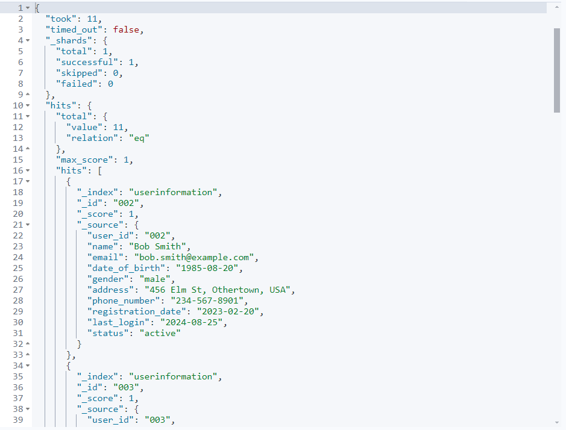
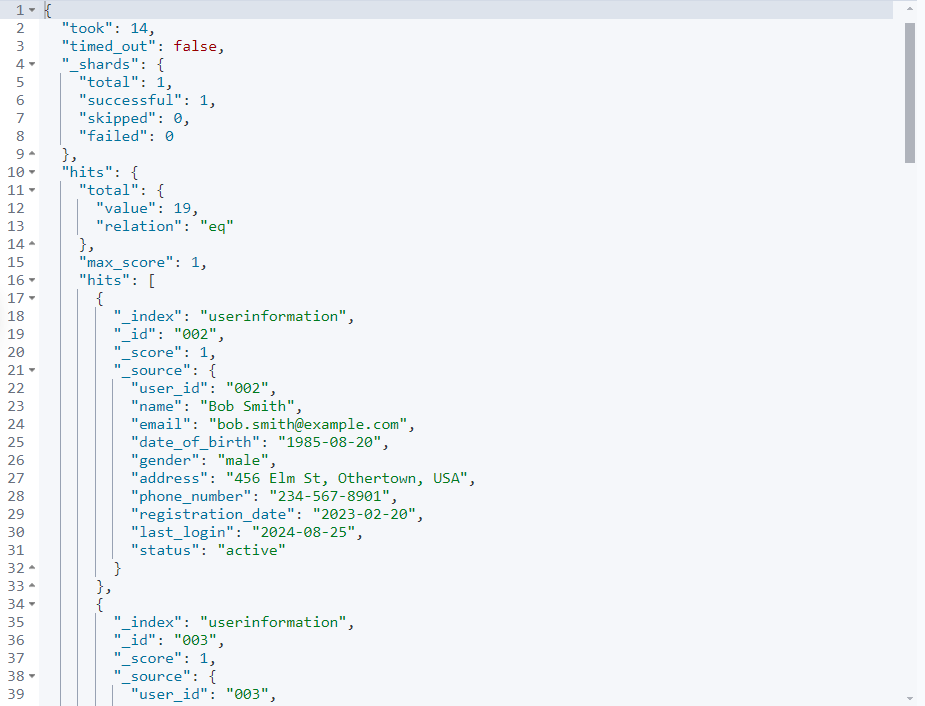
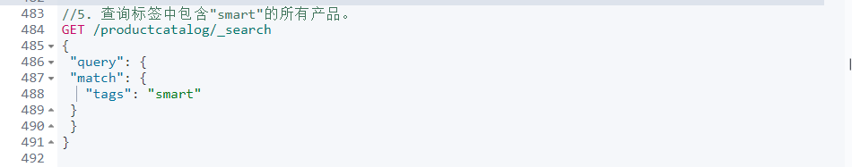

# 《实验二：索引操作与文档操作练习》

**学院：省级示范性软件学院**

**题目：《实验二：索引操作与文档操作练习》**

**姓名：焦雨飞**

**学号：2100950007**

**班级：软工2201**

**日期：2024-09-25**

**实验环境：Elasticsearch8.12.2 Kibana8.12.2**

# 一、实验目的

##### 1.掌握Elasticsearch 安装IK分词器安装方法

##### 2.掌握Elasticsearch 索引操作方法

##### 3.掌握Elasticsearch 文档操作训练

##### 4.掌握Elasticsearch 高级查询与DSL训练

# 二、实验内容

## 1. 索引操作练习

### 任务一：

#### 1.创建索引

##### 1.用户信息索引

###### 代码：

###### 结果：

##### 2.产品目录索引

###### 代码：

###### 

###### 结果：

##### 3.订单记录索引

###### 代码：

###### 结果：

#### 2.修改索引(自己设计，修改要合理）

##### 1.为用户信息索引添加字段“nickname”

###### 代码：

###### 结果：

##### 2.为产品目录索引添加字段“discount_price”

###### 代码：

###### 结果：

##### 3.为订单记录索引添加字段“customer_name”

###### 代码：

###### 结果：

#### 3.删除索引

###### 代码：

结果：

#### 4.查看所有索引

###### 代码：

###### 结果：

## 2. 文档操作练习

### 任务二：

#### 1.创建文档（以第一个用户样例为例）

代码：

结果：

#### 2.修改文档（假设我们想要更新用户`001`的电子邮件地址）

代码：

结果：

#### 3.删除文档

代码：

结果：

#### 4.查看文档（查看001的文档）

代码：

结果：

#### 5.将Json数据批量导入ES数据库中

##### 1.用户文档

代码：

结果：

##### 2.产品文档

代码：

结果：

##### 3.订单文档

代码：

结果：

## 3. 高级查询&DSL练习

### 3.1. 用户信息数据

##### 1.查询所有女性用户的姓名和电子邮件。

代码：

结果：

##### 2.查找最后登录日期在2024年9月1日之后的所有活跃用户。

代码：

结果：

##### 3.查询住在"Anytown"的用户。

代码：

结果：

##### 4.查找出生日期在1990年之后的所有用户。

代码：

结果：

##### 5.查询所有状态为"inactive"的用户。

代码：

结果;

##### 6.查找注册日期在2023年1月1日到2023年12月31日之间的用户。

代码：

结果:

##### 7.查询名字为"Bob Smith"的用户的详细信息。

代码：

结果:

##### 8.查找电话号码以"123"开头的用户。

代码：

结果:

##### 9.查询电子邮件域为"example.com"的所有用户。

代码：

结果：

##### 10.查找所有名字中包含"Lee"的用户。

代码：

结果：

### 3.2. 产品目录数据

##### 1.查询所有类别为"Audio"的产品名称和价格。

代码：

结果：

##### 2.查找价格高于50美元的所有产品。

代码：

结果：

##### 3.查询库存数量少于100的产品。

代码：

结果：

##### 4.查找评分高于4.5的所有产品。

代码：

结果：

##### 5.查询标签中包含"smart"的所有产品。

代码：

结果：

##### 6.查找供应商为"TechCorp"的产品。

代码：

结果：

##### 7.查询发布日期在2023年6月1日之后的所有产品。

代码：

结果：

##### 8.查找描述中包含"wireless"的产品。

代码：

结果：

##### 9.查询价格在20美元到100美元之间的所有产品。

代码：

结果：

##### 10.查找产品名称中包含"Light"的所有产品。

代码：

结果：

### 3.3. 订单记录数据

##### 1.查询所有状态为"completed"的订单的订单ID和总金额。

代码：

结果：

##### 2.查找总金额大于100美元的所有订单。

代码：

结果：

##### 3.查询支付方式为"paypal"的订单。

代码：

结果：

##### 4.查找订单日期在2024年2月之后的所有订单。

代码：

结果：

##### 5.查询包含产品ID为"P001"的订单。

代码：

结果：

##### 6.查找所有状态为"cancelled"的订单的客户ID。

代码：

结果：

##### 7.查询发货日期在2024年1月15日之前的订单。

代码：

结果：

##### 8.查找使用"credit_card"支付的订单。

代码：

结果：

##### 9.查询总金额在50美元到200美元之间的所有订单。

代码：

结果：

##### 10.查找订单ID中包含"OR01"的所有订单。

代码：

结果：

# 三、问题及解决办法

**问题1：** 修改索引结构失败。

**解决办法：**

1. 确保索引存在且当前用户有修改权限。
2. 检查添加的字段是否符合Elasticsearch的字段命名规则。
3. 使用正确的API命令进行修改。

**问题2：** 批量导入数据时速度慢。

**解决办法：**

1. 优化数据格式，减少不必要的字段。

2. 调整Elasticsearch的批量导入设置，如`bulk_size`。

3. 使用Elasticsearch的Bulk API进行批量操作。

   

**问题3：** 查询结果不符合预期。

**解决办法：**

1. 检查查询语句是否正确编写，特别是字段名和查询条件。

2. 确保查询使用的字段已经被正确索引。

   
